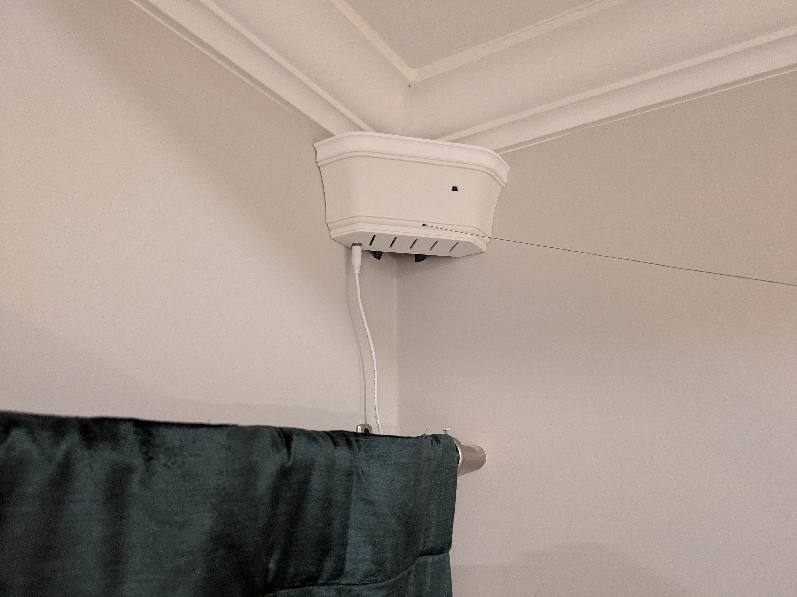

# Neufangled Robotics

Stringman Pilot Launch

<iframe width="100%" height="660" src="https://www.youtube.com/embed/KrH8pqbdQYQ?si=1y6GPm0TSk74445p" title="YouTube video player" frameborder="0" allow="accelerometer; autoplay; clipboard-write; encrypted-media; gyroscope; picture-in-picture; web-share" referrerpolicy="strict-origin-when-cross-origin" allowfullscreen></iframe>

## Purpose

Create a robot for under $1000 that can pick up clutter in your room

The largest portion of housework is picking things up and the largest proportion of those things are laundry and trash. Neither need to be handled carefully, and simply dropping them in a bin is all we really require. Why wait for humanoid robots that have 99 DOFs and cost as much as cars when we could have this now? We don't have to wait at all.

## Capabilities

Stringman can autonomously pick up small objects and drop them in a bin or into a pile in a predetermined location. More advanced autonomous classification of objects is still in development, but it is just a matter of fine tuning YOLOv8 on appropriate data.

In the pilot launch, you can still drive the robot around manually like a crane game and pick things up, or you can select all the objects you want picked up on screen and it will try to pick them up one by one and drop them all in whatever location is labelled with the destination card.

## Physical Architecture

If an object hangs from three lines of known length, its position in 3D space is fully determined. This is the principle of operation behind a Cable Driven Paralell Robot (CDPR). However to make it slightly more practical in a household setting, we use four lines so that our work area will be rectangular. The four motorized spools referred to here as **anchors** are mounted in the corners of a room. Where they meet, we could place the **gripper**, but in order to keep the lines *mostly* clear of people and furniture, we hang the gripper from a passive object we call the **gantry** by a fifth, vertical line. We lose some positional control, in exchange for making it slightly easier to live with.

Every anchor is equipped with a camera so we have four views of the work area from which to locate the robot components and the potential items of clutter to be picked up. The images are served by a process that allows only one client at a time, and the control software on your desktop PC is that client. Everything occurs locally with no cloud interaction.

On the gripper, we use one servo to reel the gripper up and down the vertical line, and one to open and close a pair of fingers. the fingers are linked by a spur gear which moves them apart symmetrically. Though our use case does not demand that we handle objects with care, the fingers have pressure sensors in order to assist the software in determining if something was picked up. The gripper is also equipped with a BNO085 IMU and a camera.

Power delivery to the gripper is done by having one of the lines be a wire running through slip rings. I've tried to choose the smallest and strongest wire possible to minmize weight and visibility. having the gripper hard wired to power means greater payload capacity, not having to deal with any charging process, and even cheaper shipping.

## Software Architecture

The robot components each contain a Raspiberry pi zero 2w, but only just enough to stream the video to the **control panel** software running on your desktop PC. The job of the control panel is to process the images from all camera angles, determine the positon of the robot, the positions of potential targets and send line lengths to the anchor spool motors.

While a lot of the latest developments in robotics have stemmed from the use of deep reinforcement learning, we can't do that yet as it would require a dataset collected from teleoperation. The control system in the current version is more similar to a Model Predictive Controller (MPO).
We take in measurements of the locations of aruco markers seen by the cameras, measurements of the actual line lengths, inertial measurments from the gripper, and predictions of how the components would move according to physics, and the desired future locations, and then fit a 3D Bspline to that data that representing our estimate of where a component is located over time from 10 seconds ago, to 10 seconds in the future. We then update that estimate as fast as possible. This way we always have some estimate of the current location even if visual observation latency is 1 to 4 seconds. So while it is not deep reinforcement learning, it isn't exactly MPC either because perception and planning are done in the same cost minimization step. For those interested in seeing what other terms go into the cost function, see `cost_function()` in [position_estimator.py](https://github.com/nhnifong/cranebot3-firmware/blob/main/position_estimator.py)

## Cost

$692 - Hardware kit

All the mechanical parts can be 3D printed with adequate strength and precision.
Building the robot requires some experience soldering, assembling small objects, and working from a linux command line. If you're not sure if that's for you, take a look at the build guides to get an idea of what it involves.

$1024 - Fully Assembled

The complete robot ships as four anchors and one gripper. The anchors will still have to be mounted to the walls, the gripper connected to the lines that are pre-wound on the anchor spools, and the calibration process run, but you should be up and running in about an hour.

Hidden cost:

Desktop PC. I can't honestly neglect to mention that you need newer PC in order to run the control software. processing five video streams at the same time while running scikit.minimize in a loop as fast as possible will take at least 6 cores, and ideally an Nvidia GPU though It works without one. Without at least a Ryzen 7, autonomous movement may be too choppy to use.

## Safety

Try not to hit your head on the robot